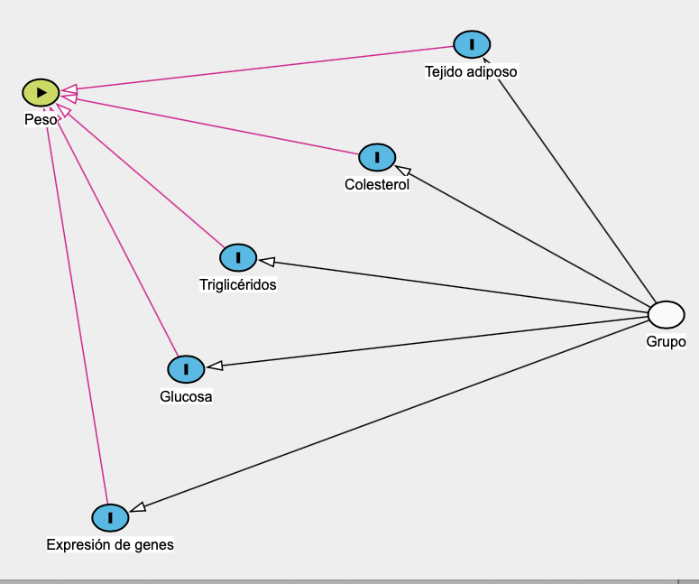

# **INTRODUCCIÓN**

#### Los cambios en los estilos de vida de las personas durante los últimos 40 años han llevado a un cambio en la alimentación, que se caracteriza por un aumento en el consumo de alimentos altos en grasa y carbohidratos simples y que poseen una alta palatabilidad, pero también una alta densidad energética. Lo anterior, contribuye con el dramático aumento en los índices de obesidad, tanto en países desarrollados como en vías de desarrollo (Morris et al., 2015). Algunas estimaciones indican que aproximadamente mil millones de personas alrededor del mundo tienen sobrepeso, y 400 millones de estas son obesas (Morris et al., 2015). 

#### En Costa Rica la obesidad ha aumentado considerablemente en los últimos años. Según datos de población urbana costarricense, aproximadamente el 63% de las personas entre 15-65 años muestran alteraciones del peso corporal (Fisberg et al., 2016; Kovalskys et al., 2019), y a nivel nacional pero en población escolar, se reportó una prevalencia de 34% de sobrepeso y obesidad (Ministerio de Salud y Ministerio de Educación Pública, 2017).

#### La obesidad es un trastorno metabólico que se caracteriza por una acumulación excesiva de tejido adiposo, además de un índice de masa corporal (IMC) mayor a 30. Su desarrollo involucra una interacción compleja entre la susceptibilidad genética individual y el ambiente en el que se desenvuelven los individuos, caracterizado por una dieta alta en alimentos energéticamente densos, ricos en grasa y azúcar, unido a estilos de vida sedentarios y con altos niveles de estrés que acompañan la vida moderna occidental (Lyon & Hirschhorn, 2005; Popkin & Reardon, 2018). 

#### La ganancia de peso puede ser debida a múltiples factores, por ejemplo genéticos, metabólicos o ambientales.  Este último factor tiene especial relevancia, pues el aumento en las cifras de obesidad va de la mano con el aumento en jornadas de trabajo, así como situaciones de estrés generadas en las personas desde etapas tempranas (Morris et al., 2015). Las facilidades para obtener alimentos energéticamente densos y de bajo costo han aumentado, incluso algunos estudios reportan que las personas llaman a estos alimentos comida “confort”, en respuesta a su consumo tras situaciones estresantes (Toniyama et al., 2011). El consumo de alimentos palatables puede entonces asociarse con situaciones de estrés, aumentando su consumo.  

#### El consumo excesivo de alimentos de alta palatabilidad, o sabrosos, puede resultar en alteraciones de los parámetros biométricos relacionados con el peso corporal, como lo son un aumento en el IMC y un aumento en la grasa corporal (Blumenthal & Gold, 2010). El consumo de los alimentos mencionados  pueden inducir cambios neuroplásticos y llevar al individuo a la sobreingesta de estos, debido a una activación del sistema mesocorticolímbico-dopaminérgico (DA), el cual consta de regiones cerebrales como el estriado dorsal (ED) y el núcleo accumbens (Nac) (Berthoud, Lenard & Shin, 2001; Morris et al. 2015).

#### El estudio de la obesidad es complejo, principalmente debido a que es difícil y complicado éticamente estudiar poblaciones humanas. Por este motivo es que se utilizan modelos animales tales como los que describe Kleinert y colaboradores (2018). Generar obesidad en animales de laboratorio permite controlar muchas de las variables que llevan al desarrollo de obesidad, así como de estudiar alteraciones en la conducta, tales como el estrés y la ansiedad. Esto se realiza alimentando a los animales con una dieta de cafetería, una dieta alta en grasas y carbohidratos provenientes de alimentos de consumo humano, con el fin de generar características biométricas que llevan al desarrollo de obesidad: altos valores de glucosa en sangre, altos valores de triglicéridos y colesterol en sangre y un alto porcentaje de grasa en tejido adiposo. Además, el consumo de alimentos de alta palatabilidad puede alterar la expresión de muchos genes, entre ellos los relacionados con procesos de ansiedad en algunas regiones del sistema DA, estos genes son CREB, BDNF y su receptor TrkB. Estas características llevan al individuo al desarrollo del fenotipo obeso, que se manifiesta principalmente por un aumento en el peso. 

#### Nuestro proyecto pretende estudiar los efectos del consumo de una dieta de alta palatabilidad sobre cambios neuroplásticos que llevan al individuo a la sobreingesta de estos, debido a una activación del sistema mesocorticolímbico-dopaminérgico, y que puede generar alteraciones en genes asociados con estrés y ansiedad. Los datos de este experimento son tomados de un piloto que se realizó para verificar que los animales no sufran alteracones gastrointestinales por la dieta, por lo que se aprovecharon los datos para  **identificar las variables que tengan un efecto significativo sobre la variable respuesta, para saber cuáles no son importantes de considerar en futuros modelos.**

#### Este análisis incluye un DAG tipo pipe que relaciona el tipo de dieta (sea dieta de cafetería o control), y las diferentes variables que llevan al individuo a aumentar o disminuir el peso. Los controles consumieron alimento de roedor de laboratorio estándar. 



# **METODOLOGÍA Y RESULTADOS**

#### El experimento se realizó en la sala de experimentación animal del Laboratorio de Ensayos Biológicos de la UCR. La exposición a la dieta, o al alimento estándar para el caso de los controles, fue de 90 días. Posterior a la exposición los animales se pesaron y se realizó la eutanasia de los mismos, con el fin de colectar todo el tejido adiposo perogonadal y abdominal (que representa la grasa corporal),y las secciones del cerebro que se querían estudiar. Una vez extraídas las regiones cerebrales se congelaron con el reactivo preservante TRIzol, y se congelaron a -80ºC, con el fin de evitar la degradación de ARN. Además se colectó sangre troncal, para analizar parámetros de bioquímica sanguínea como glucosa,triglicéridos y colesterol total. Para la expresión genética se realizó una qPCR y se analizaron los valores de delta-RT, que son los que aparecen en la base de datos.

#### Cuando se obtuvieron los resultados respectivos y se tabularon los resultados se procedió con el análisis siguiente:

#### Cargamos las librerías 
```{r, echo=FALSE, include=F}

setwd("~/Documents/GitHub/Proyecto_Final_Investigacion_reproducible")
```

```{r, echo=FALSE, message=FALSE}

library(knitr)
library(markdown)
library(httpuv)
library(caTools)
library(ggplot2)
library(car)
library(ggplot2)
library(GGally)
library(psych)
library(pscl)
library(MuMIn)
library(lmtest)
library(leaps)
library(olsrr)
library(hier.part)
library(nlme)
library(R.utils)

```
#### Las librerías necesarias son las siguientes:

```{r, eval=FALSE, echo=TRUE}
library(knitr)
library(prettydoc)
library(caTools)
library(ggplot2)
library(car)
library(ggplot2)
library(psych)
library(pscl)
library(MuMIn)
library(lmtest)
library(nlme)

```

#### Cargamos la base de datos con todas las variables, recordando que la variable dependiente es el peso al final de la semana 9 (PESOSEM)

```{r, echo= T}

 obesos <- read.csv("Piloto1.csv", header = T, sep = ";")

```

```{r}

str(obesos)
head(obesos)


```

#### Primero vamos a evaluar los supuestos de toda la base:

# **NORMALIDAD**

```{r}
pairs.panels(obesos, 
             method = "pearson", # correlation method
             hist.col = "#00AFBB",
             density = TRUE,  # show density plots
             ellipses = F # show correlation ellipses
)   

```

#### Las variables presentan una distribución normal de sus datos.

# **MULTICOLINEALIDAD**

```{r, echo=F, eval=T}

names(obesos)
cor(obesos,  method = c("pearson"))

vif(lm(PESOSEM9 ~ GRUPO + TADIPOSO.REL + COL.mg.dL.+ GLUC..mg.dL. + TG..mg.dL. + ED.BDNF + ED.TrkB + ED.CREB + Nac.CREB + Nac.BDNF + Nac.TrkB, data = obesos))

```
#### Existen correlaciones positivas y negativas entre las variables, la variable respuesta peso está correlacionada positivamente con variables como el tejido adiposo relativo, la expresión de BDNF en el estriado dorsal, la expresión de CRF, TrkB y CREB en la corteza prefrontal, así como en el consumo total de grasa y carbohidratos.

# **RESIDUALES**

```{r, echo=T, eval=T}

obesos$GRUPO <- as.factor(obesos$GRUPO)
obesos.lm <- lm(PESOSEM9 ~ GRUPO + TADIPOSO.REL + COL.mg.dL.+ GLUC..mg.dL. +                     TG..mg.dL. + ED.BDNF + ED.TrkB + ED.CREB + Nac.CREB + 
                    Nac.BDNF + Nac.TrkB, data = obesos)

par(mfrow = c(2, 2), oma = c(0, 0, 0, 0))
plot(obesos.lm, ask = F, which = 1:4)

par(mfrow = c(1, 1), oma = c(0, 0, 0, 0))
hist(obesos.lm$residuals)

shapiro.test(obesos.lm$residuals)
```

#### Conclusión: El gráfico Q-Q e histograma muestra que los residuales no desvián de una distribución normal. La prueba SW tampoco muestra que no hay evidencia de que los residuos no sigan una distribución normal. Entonces las pruebas de hipótesis son confiables.

# **SELECCIÓN DEL MODELO**

#### Selección automatizada:

```{r, echo=T, eval=T}

options(na.action = "na.fail")
m <- dredge(obesos.lm, rank="AIC")

```

#### La selección automatizada nos da varias variables que aparecen en casi todos los modelos, vamos a elegir las que sean más constantes en los modelos y a probar combinaciones entre ellas.

```{r, echo=T, eval=T}

m0 <- lm(PESOSEM9 ~ 1, data = obesos)
m.n <- lm(PESOSEM9 ~ GLUC..mg.dL. + GRUPO + Nac.BDNF + Nac.TrkB + TADIPOSO.REL + Nac.CREB, data = obesos)
m.n1 <- lm(PESOSEM9 ~ GLUC..mg.dL., data = obesos)
m.n2 <- lm(PESOSEM9 ~ GLUC..mg.dL. + GRUPO, data = obesos)
m.n3 <- lm(PESOSEM9 ~ GLUC..mg.dL. + GRUPO + Nac.BDNF, data = obesos)
m.n4 <- lm(PESOSEM9 ~ GLUC..mg.dL. + GRUPO + Nac.BDNF + Nac.TrkB, data = obesos)
m.n5 <- lm(PESOSEM9 ~ GLUC..mg.dL. + GRUPO + Nac.BDNF + Nac.TrkB + TADIPOSO.REL, data = obesos)
m.n6 <- lm(PESOSEM9 ~ GLUC..mg.dL. + GRUPO + TADIPOSO.REL, data = obesos)

```

#### Ahora comparamos los AIC de los modelos hechos para elegir el que tenga un AIC menor

```{r, echo=T, eval=T}

AIC(m0, m.n, m.n1, m.n2, m.n3, m.n4, m.n5, m.n6)

anova(m.n, m.n5, test ="Chi")

summary(m.n5)

avPlots(m.n, ask=F)

```


####Estos gráficos nos permiten evaluar los residuales de las variables predictoras.


# **GRÁFICOS DE PREDICCIONES**

```{r, echo=T, eval=T}


newdata <- data.frame(TADIPOSO.REL= seq(from= min(obesos$TADIPOSO.REL), 
                      to= max(obesos$TADIPOSO.REL), 
                      l=1000),
                      GLUC..mg.dL. = mean(obesos$GLUC..mg.dL.),
                      Nac.BDNF= mean(obesos$Nac.BDNF),
                      Nac.TrkB= mean(obesos$Nac.TrkB),
                      Nac.CREB = mean(obesos$Nac.CREB),
                      GRUPO = levels(obesos$GRUPO))

# Objeto con valores predichos por el modelo
newdata2 <- cbind(newdata, predict(m.n5, newdata, type = "response", 
                                   se.fit = TRUE))

fit <- newdata2$fit
LL <- newdata2$fit - 1.96 * newdata2$se.fit
UL <- newdata2$fit + 1.96 * newdata2$se.fit

# Guardar valores predichos en nueva base de datos
newdata3 <- data.frame(newdata2$TADIPOSO.REL,
                       newdata2$GLUC..mg.dL.,
                       newdata2$Nac.BDNF,
                       newdata2$Nac.TrkB,
                       newdata2$Nac.CREB,
                       newdata2$GRUPO,
                       fit, LL, UL)

names(newdata3) <- c("adiposo", "glucosa","Nac_BDNF", 
                     "Nac_TrkB", "Nac_CREB", "grupo",
                     "fit", "LL", "UL")


# Poner datos originales y la predicci?n del modelo en una misma base
#newdata4 <- cbind(obesos, newdata3)
#head(newdata4)

# Grafico 1
p1 <- ggplot(newdata3, aes(x = adiposo, y = fit, fill = grupo)) +
  geom_ribbon(aes(ymin = LL, ymax = UL), alpha = 0.30) +
  geom_line(aes(color = grupo), size = 1, lty = 5) +
  labs(x = "Tejido adiposo", y = "Peso") +
  theme_classic() +
  theme(panel.border= element_blank())+
  theme(axis.line.x = element_line(color="black", size = .7),
        axis.line.y = element_line(color="black", size = .7)) +
  theme(axis.text=element_text(size=12),
        axis.title=element_text(size=14)) +
  theme(text = element_text(size=12))

p1


```

```{r, eval=T, echo=T}

newdata <- data.frame(TADIPOSO.REL= mean(obesos$TADIPOSO.REL),
                      GLUC..mg.dL. = seq(min(obesos$GLUC..mg.dL.), 
                                         max(obesos$GLUC..mg.dL.),
                                         l = 1000),
                      Nac.BDNF= mean(obesos$Nac.BDNF),
                      Nac.TrkB= mean(obesos$Nac.TrkB),
                      Nac.CREB = mean(obesos$Nac.CREB),
                      GRUPO = levels(obesos$GRUPO))

# Objeto con valores predichos por el modelo
newdata2 <- cbind(newdata, predict(m.n5, newdata, type = "response", 
                                   se.fit = TRUE))

fit <- newdata2$fit
LL <- newdata2$fit - 1.96 * newdata2$se.fit
UL <- newdata2$fit + 1.96 * newdata2$se.fit

# Guardar valores predichos en nueva base de datos
newdata3 <- data.frame(newdata2$TADIPOSO.REL,
                       newdata2$GLUC..mg.dL.,
                       newdata2$Nac.BDNF,
                       newdata2$Nac.TrkB,
                       newdata2$Nac.CREB,
                       newdata2$GRUPO,
                       fit, LL, UL)

names(newdata3) <- c("adiposo", "glucosa","Nac_BDNF", 
                     "Nac_TrkB", "Nac_CREB", "grupo",
                     "fit", "LL", "UL")


# Poner datos originales y la predicci?n del modelo en una misma base
#newdata4 <- cbind(obesos, newdata3)
#head(newdata4)

# Grafico 1
p1 <- ggplot(newdata3, aes(x = glucosa, y = fit, fill = grupo)) +
    geom_ribbon(aes(ymin = LL, ymax = UL), alpha = 0.30) +
    geom_line(aes(color = grupo), size = 1, lty = 5) +
    labs(x = "Glucosa", y = "Peso") +
    theme_classic() +
    theme(panel.border= element_blank())+
    theme(axis.line.x = element_line(color="black", size = .7),
          axis.line.y = element_line(color="black", size = .7)) +
    theme(axis.text=element_text(size=12),
          axis.title=element_text(size=14)) +
    theme(text = element_text(size=12))

p1
```

# **CONCLUSIONES**

#### El modelo elegido nos permitió identificar las variables *GLUC..mg.dL. + GRUPO + Nac.BDNF + Nac.TrkB + TADIPOSO.REL + Nac.CREB* como las variables que explicaban el aumento en el peso de los animales al recibir dieta de cafetería. Sin embargo, solo el tejido adiposo en gramos y la concentración de glucosa en sangre tuvieron un efecto significativo sobre la variable respuesta. Es interesante mencionar que la concentración de glucosa en sangre más bien aumentó en animales control, esto fue un indicador para empezar a estudiar la calidad de alimento estándar que reciben los animales de laboratorio. Se realizaron otras pruebas posteriores para lograr identificar que este alimento no era el mejor, y se realizó el cambio a niver institucional.
